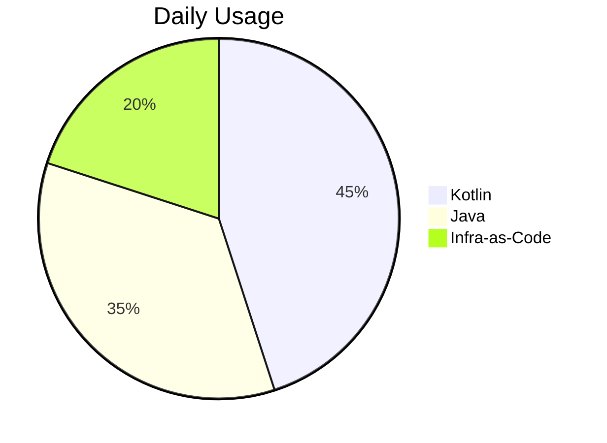

# Egor Aleksandrovich Gorbatov  
**Senior Backend Developer**  
`Kotlin | Java | Distributed Systems`  

📍 St. Petersburg, Russia | 🚀 Open to relocation: Moscow/Dublin/Berlin  
📧 [ksanichalive@gmail.com](mailto:ksanichalive@gmail.com) | 📞 +7 (921) 434-5947  
🔗 [GitHub/yourhandle](https://github.com/) | [LinkedIn](https://linkedin.com/) | [Telegram @singularity024](https://t.me/singularity024)  

---

## 🚀 Technical Profile  
```kotlin
data class Profile(
    val expertise: List<String> = listOf(
        "High-load Systems (1M+ RPS)",
        "Microservices Architecture",
        "ML Platform Development"
    ),
    val architecture: String = "Event-Driven CQRS"
)
```

**Core Stack**:  
   
   
   

---

## 💼 Professional Experience  

### **Ozon Technologies** | Senior Software Engineer  
`06/2024 – Present` | Remote  
- Led development of ML inference platform handling **12K RPS**  
- Optimized JVM performance (↓40% P50 latency)  
- Designed Spark integration for batch processing (1.2TB/day)  
**Tech**: `Kotlin` `gRPC` `K8s` `ArgoCD`  

### **Yandex FinTech** | Software Engineer  
`02/2022 – 09/2023` | St. Petersburg  
- Built core banking services for 20M+ clients  
- Implemented circuit breaker pattern (↓65% outages)  
**Tech**: `Spring Boot` `Kafka` `JOOQ` `Prometheus`  

---

## 🛠 Technical Skills  

### **Languages & Frameworks**  


### **Data Technologies**  
| Category       | Technologies                      |
|----------------|----------------------------------|
| Databases      | PostgreSQL, Oracle, Redis        |
| Streaming      | Kafka, RabbitMQ                   |
| Analytics      | Spark, Flink                     |

---

## 🌟 Key Projects  

### **Distributed Transaction Engine**  
`Nexign | 2021`  
- Designed system handling **15K TPS** across 3 DCs  
- Implemented Saga pattern with RabbitMQ  
```java
public class SagaCoordinator {
    @Compensate
    public void compensateOrder(Order order) {
        paymentService.refund(order);
    }
}
```

---

## 🏆 Open Source  

### [Kotlin Kafka DSL](https://github.com/)  
  
- Type-safe stream processing library  
- Used by 3 startups  

### [PG-Bouncer K8s Operator](https://github.com/)  
  
- Automated Postgres connection pooling  

---

## 🎓 Education  
**Saint Petersburg Polytechnic University**  
`2019 – 2021` | Information Systems  

**Certifications**:  
- 🎓 Highload Applications (Mail.ru Group)  
- ☸️ CKAD (In Progress)  

---

> "I architect systems that scale exponentially while keeping code maintainable."
> ---
> 
